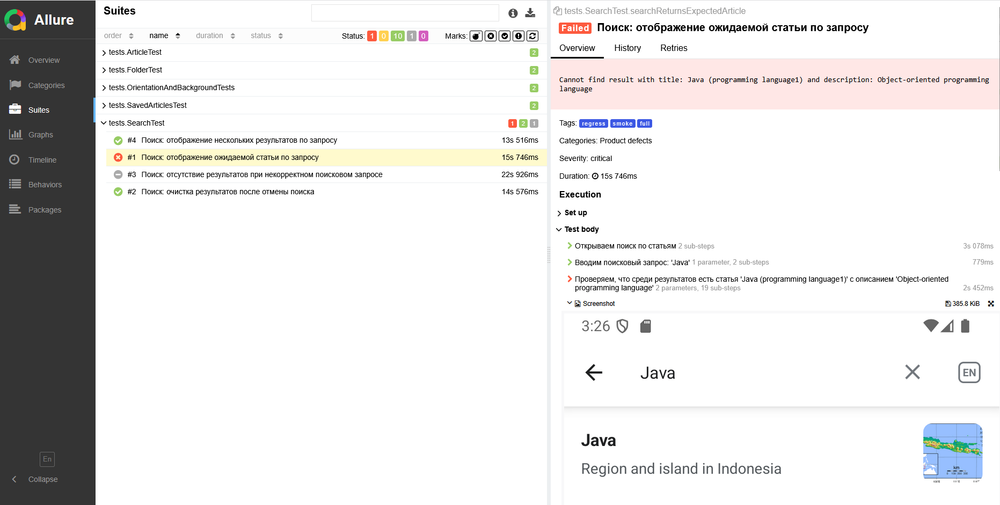

# 📱 Wikipedia Mobile Automation Framework

Автоматизированный проект для тестирования мобильного приложения Wikipedia (Android) с использованием:

✅ Appium (Mobile Automation)  
✅ Selenide (UI-обертка)  
✅ JUnit 5 (тестовый фреймворк)  
✅ Gradle (сборка)  
✅ Java 17+  
✅ Allure (отчёты)  
✅ Jenkins (планируется для CI/CD)  
✅ Android Emulator API 30+

---

## ⚙️ Установка

1. Клонировать репозиторий:

```bash
git clone https://github.com/Sentidas/wikipedia-mobile-automation.git
```

2. Установить зависимости (Node.js, npm, Appium).

3. Запустить Appium сервер:

```bash
appium server
```

4. Запустить Android эмулятор

---
### Запуск через Gradle

#### Запуск всех тестов:

```bash
./gradlew clean test
```

#### Запуск отдельного теста:

```bash
./gradlew clean test --tests tests.SearchTest
```

---

## 📊 Генерация отчётов Allure

#### Формирование отчёта:

```bash
allure generate build/allure-results --clean -o build/allure-report
```

#### Запуск локального сервера отчёта:

```bash
allure serve build/allure-results
```

#### Примеры Allure-отчётов:

## 📊 Примеры Allure-отчётов

### Общая сводка:


### Тесты:


### Пример упавшего теста:



---

## 🎞 Демонстрация выполнения тестов

• Удаление сохранненой статьи:


• Сохранение результатов поиска после сворачивания и возврата в приложение:


